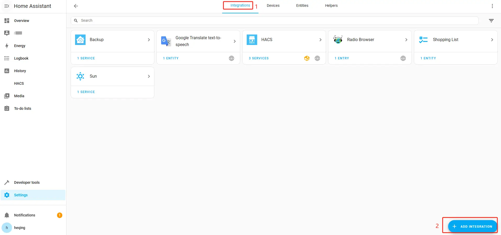
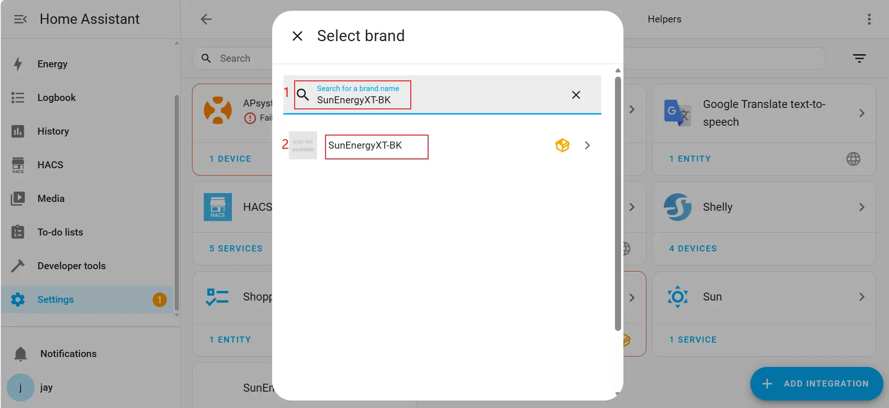
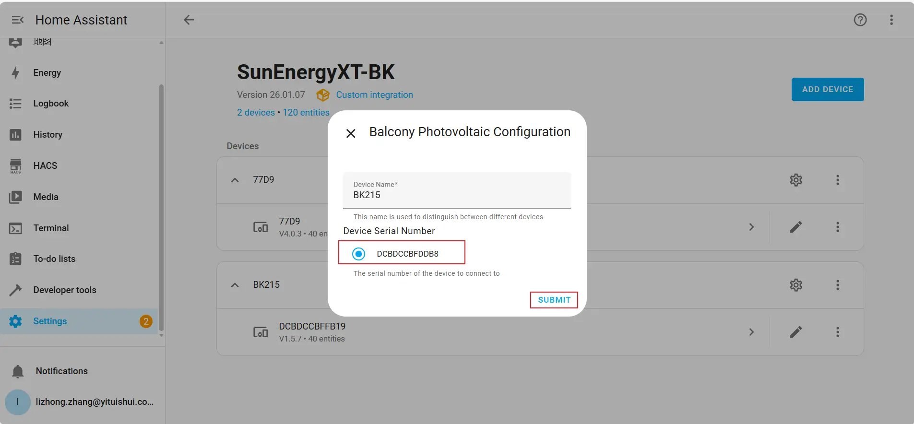
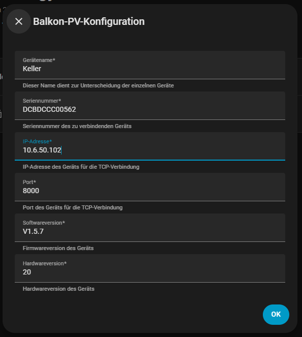

# SunEnergyXT-BK for Home Assistant

Local Home Assistant integration for **SunEnergyXT BK215 / BK215Plus** battery systems.

This integration connects directly to the device over the **local TCP protocol** on port **8000** and does not require any cloud account.

## What this integration does

The integration provides:

- battery SOC sensors
- hardware SOC limit sensors
- charge and mode configuration entities
- dynamic entity creation only for points that are really available on your firmware
- support for one head unit plus up to 7 expansion batteries
- local diagnostic polling for known protocol blocks
- Home Assistant config flow setup
- HACS installation support

Observed protocol blocks used by the integration:

- `0x6052` main status block
- `0x6055` SOC / limit block
- `0x6059` diagnostic / error block

## Installation via HACS

1. Open **HACS**
2. Go to **Integrations**
3. Open the menu in the top right corner
4. Select **Custom repositories**
5. Add this repository as an **Integration**
6. Install **SunEnergyXT-BK**
7. Restart Home Assistant

### Step 1 — Add the custom repository

### Step 2 — Install the integration in HACS

## Setup in Home Assistant

1. Open **Settings**
2. Open **Devices & Services**
3. Click **Add Integration**
4. Search for **SunEnergyXT-BK**
5. Enter the device data manually or use discovery

### Step 3 — Add the integration

### Step 4 — Manual configuration example

Use the device IP address and TCP port from the inverter or battery system.

Typical values:

- **IP address:** `10.6.50.106`
- **Port:** `8000`

Example manual configuration screen:

## Supported setup

Designed for:

- SunEnergyXT BK215
- SunEnergyXT BK215Plus
- one head unit plus up to 7 expansion batteries
- local TCP endpoint on port `8000`

## Important design choices

- The integration only creates entities when a protocol point was seen with a valid value.
- Unsupported values like `-1` or `0xFFFFFFFF` do **not** create entities.
- This prevents entity clutter on firmware versions that do not expose all points.

## Troubleshooting

### The integration does not connect

Check:

- the IP address
- that port `8000` is reachable
- that the device is online
- that local communication is enabled

### Some entities stay unavailable

This can happen when:

- a protocol point is not supported by your firmware
- a battery expansion slot is not populated
- the device reports `-1` for unsupported values

### Discovery does not find the device

Use manual configuration with:

- serial number
- IP address
- port `8000`

## Development and validation

The repository includes:

- **Dependabot** for dependency updates
- **Hassfest** validation
- **HACS** validation
- **Ruff** linting and syntax checks

## Notes

The `documentation`, `issue_tracker` and `codeowners` fields in `manifest.json` use placeholders and should be adjusted after you publish the repository to GitHub.

## Disclaimer

This is a community integration and is **not** affiliated with or supported by SunEnergyXT.
